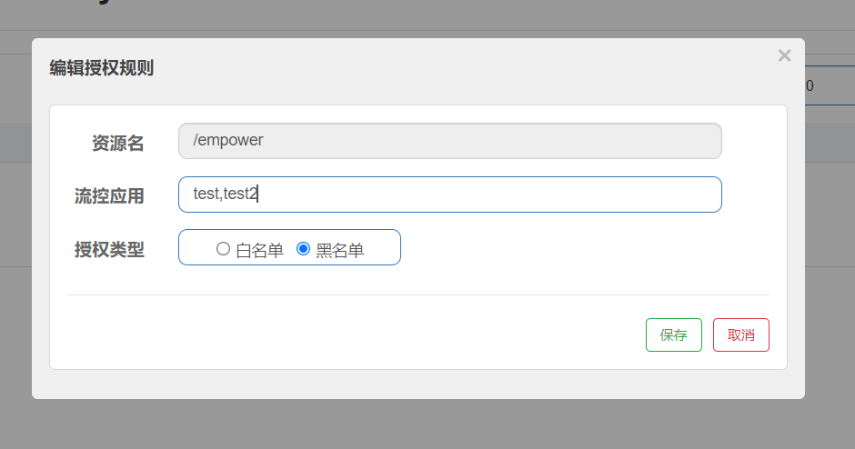

## 授权规则概述

在某些场景下，需要根据调用接口的来源判断是否允许执行本次请求。此时就可以使用 Sentinel 提供的授权规则来实现，Sentinel 的授权规则能够根据请求的来源判断是否允许本次请求通过。

在 Sentinel 的授权规则中，提供了 白名单与黑名单 两种授权类型。白放行、黑禁止

## 授权规则

/empower 请求如果带有 serverName 参数，并且参数为 test 或 test2 则不通过，无法访问



**请求代码**

```java
@RestController
@Slf4j
public class EmpowerController //Empower授权规则，用来处理请求的来源
{
    @GetMapping(value = "/empower")
    public String requestSentinel4(){
        log.info("测试Sentinel授权规则empower");
        return "Sentinel授权规则";
    }
}
```

**规则代码**

```java
@Component
public class MyRequestOriginParser implements RequestOriginParser
{
    @Override
    public String parseOrigin(HttpServletRequest httpServletRequest) {
        return httpServletRequest.getParameter("serverName");
    }
}
```
