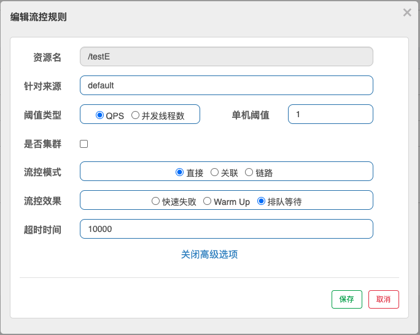

## 流控模式

### 直接
一秒请求两个，超过则失败。

### 关联
`/testA`请求，一秒请求1个，超过1个，限流`/testB`请求

### 链路
`common()`方法同时被`/testC`和`testD`调用，实施针对性的不同限流措施，比如`/testC`请求来访问就限流，`testD`请求来访问就不限流

## 流控效果
### 直接
快速失败。

### 预热WarmUp
5秒钟内每秒可访问3次，过了保护期5秒后每秒可访问10次

### 排队等待
一秒钟通过一个请求，10秒后的请求作为超时处理，放弃

