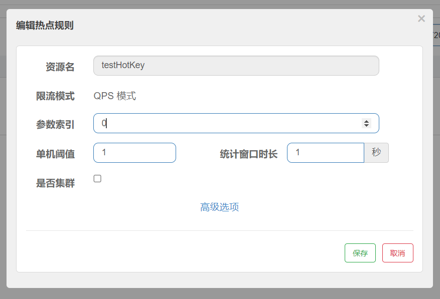
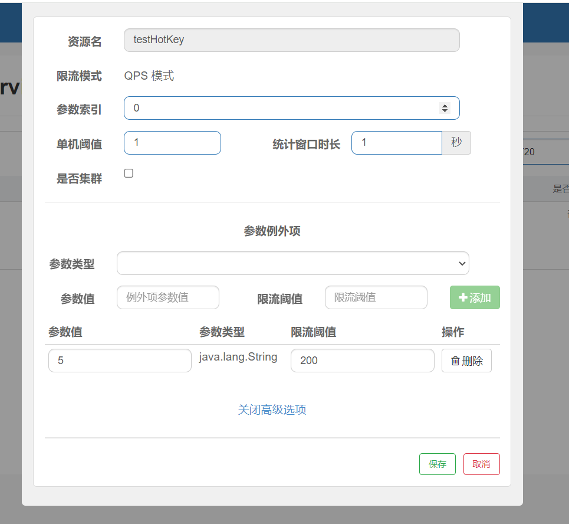

## 何为热点

热点即经常访问的数据，很多时候我们希望统计或者限制某个热点数据中访问频次最高的 TopN 数据，并对其访问进行限流或者其它操作

## 热点规则

方法 testHotKey 里面第一个参数 P1 只要 QPS 超过每秒 1 次，马上降级处理

- 请求路径中不管有几个参数只要包含了 p1 参数，1 秒内的请求超过 1 次，就会进行限流降级处理
- 不包含 p1 数不会触发限流降级处理

## 参数例外项

当 p1 参数等于指定值时，限流规则发生变化。假如当 p1 的值等于 5 时，它的阈值可以达到每秒请求 200 次

