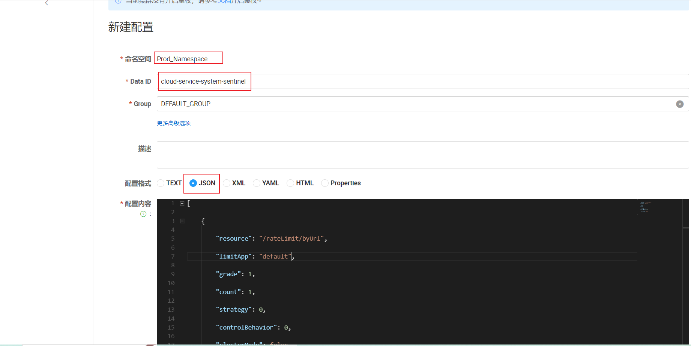
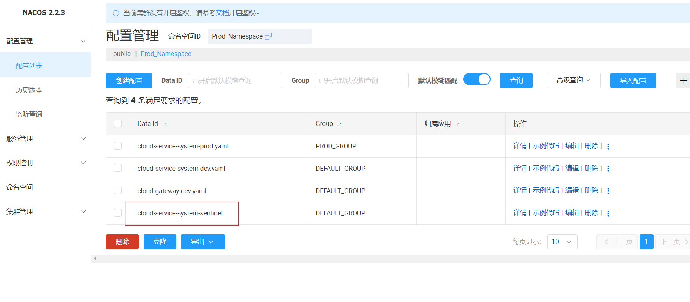
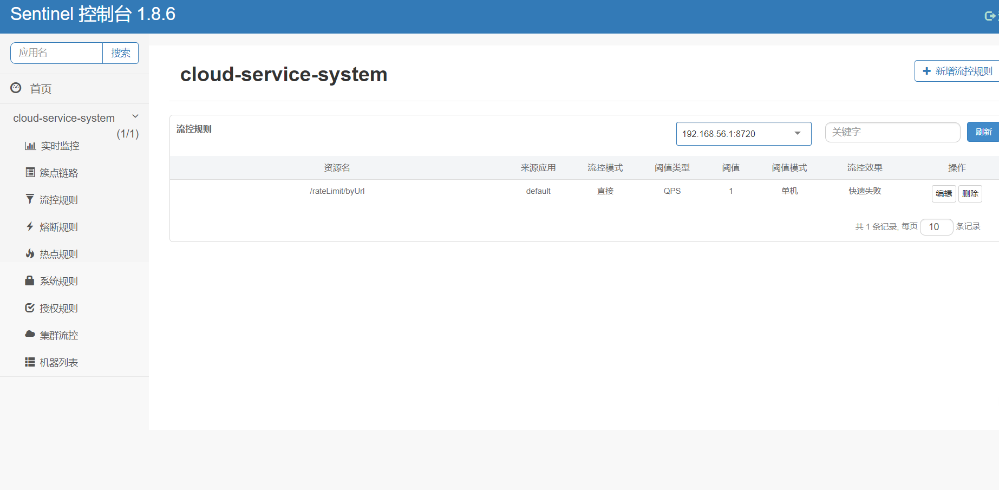

## 为什么要持久化

一旦我们重启微服务应用，sentinel 规则将消失，生产环境需要将配置规则进行持久化

## 怎么实现持久化

将限流配置规则持久化进 Nacos 保存，只要刷新 8401 某个 rest 地址，sentinel 控制台的流控规则就能看到，只要 Nacos 里面的配置不删除，针对 8401 上 sentinel 上的流控规则持续有效

## 实现步骤

### pom 添加依赖

```xml
<!--SpringCloud ailibaba sentinel-datasource-nacos -->
<dependency>
    <groupId>com.alibaba.csp</groupId>
    <artifactId>sentinel-datasource-nacos</artifactId>
</dependency>
```

### yml 配置文件添加配置

重点内容：datasource 的配置

```yml
spring:
  cloud:
    sentinel:
      transport:
        dashboard: localhost:8080 #配置Sentinel dashboard控制台服务地址
        port: 8719 #默认8719端口，假如被占用会自动从8719开始依次+1扫描,直至找到未被占用的端口
      web-context-unify: false # controller层的方法对service层调用不认为是同一个根链路
      datasource:
        ds1: #自定义key
          nacos:
            server-addr: localhost:8848
            dataId: ${spring.application.name}-sentinel
            namespace: ${custom.nacos.namespace}
            data-type: json
            rule-type: flow # com.alibaba.cloud.sentinel.datasource.RuleType
```

### 添加 Nacos 业务规则配置



```json
[
  {
    "resource": "/rateLimit/byUrl",

    "limitApp": "default",

    "grade": 1,

    "count": 1,

    "strategy": 0,

    "controlBehavior": 0,

    "clusterMode": false
  }
]
```

**json 说明**

- resource：资源名称；
- limitApp：来源应用；
- grade：阈值类型，0 表示线程数，1 表示 QPS；
- count：单机阈值；
- strategy：流控模式，0 表示直接，1 表示关联，2 表示链路；
- controlBehavior：流控效果，0 表示快速失败，1 表示 Warm Up，2 表示排队等待；
- clusterMode：是否集群。



最后重启微服务，查看 sentinel 流程控制


