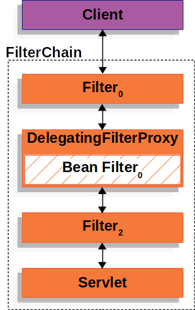
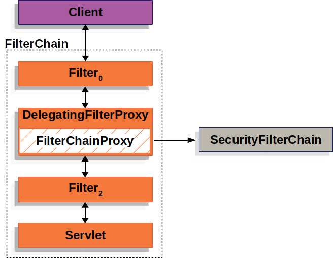
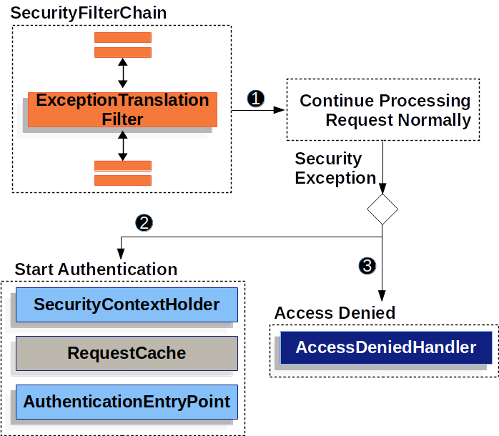

## DelegatingFilterProxy

可以通过标准的 Servlet 容器机制注册`DelegatingFilterProxy`



## FilterChainProxy

FilterChainProxy是 Spring Security 提供的特殊Filter，它允许通过SecurityFilterChain委托给多个Filter实例。



## SecurityFilterChain

SecurityFilterChain被FilterChainProxy用于确定应该为当前请求调用哪些 Spring Security Filter 实例。


多个 SecurityFilterChain 实例：


在多个 SecurityFilterChain 图中，FilterChainProxy 决定应该使用哪个 SecurityFilterChain。仅调用匹配的第一个 SecurityFilterChain。

## ExceptionTranslationFilter

ExceptionTranslationFilter 允许将 AccessDeniedException 和 AuthenticationException 转换为 HTTP 响应。
ExceptionTranslationFilter 作为安全筛选器之一插入到 FilterChainProxy 中。




 如果应用程序没有抛出AccessDeniedException或AuthenticationException，则ExceptionTranslationFilter不执行任何操作。 


DisableEncodeUrlFilter

WebAsyncManagerIntegrationFilter

SecurityContextHolderFilter

HeaderWriterFilter

CsrfFilter

LogoutFilter

UsernamePasswordAuthenticationFilter

DefaultResourcesFilter

DefaultLoginPageGeneratingFilter

DefaultLogoutPageGeneratingFilter

BasicAuthenticationFilter

RequestCacheAwareFilter

SecurityContextHolderAwareRequestFilter

AnonymousAuthenticationFilter

ExceptionTranslationFilter

AuthorizationFilter

```java
/*
 * Copyright 2002-2024 the original author or authors.
 *
 * Licensed under the Apache License, Version 2.0 (the "License");
 * you may not use this file except in compliance with the License.
 * You may obtain a copy of the License at
 *
 *      https://www.apache.org/licenses/LICENSE-2.0
 *
 * Unless required by applicable law or agreed to in writing, software
 * distributed under the License is distributed on an "AS IS" BASIS,
 * WITHOUT WARRANTIES OR CONDITIONS OF ANY KIND, either express or implied.
 * See the License for the specific language governing permissions and
 * limitations under the License.
 */

package org.springframework.security.config.annotation.web.builders;

import java.util.Comparator;
import java.util.HashMap;
import java.util.Map;

import jakarta.servlet.Filter;

import org.springframework.security.web.access.ExceptionTranslationFilter;
import org.springframework.security.web.access.channel.ChannelProcessingFilter;
import org.springframework.security.web.access.intercept.AuthorizationFilter;
import org.springframework.security.web.access.intercept.FilterSecurityInterceptor;
import org.springframework.security.web.authentication.AnonymousAuthenticationFilter;
import org.springframework.security.web.authentication.AuthenticationFilter;
import org.springframework.security.web.authentication.UsernamePasswordAuthenticationFilter;
import org.springframework.security.web.authentication.logout.LogoutFilter;
import org.springframework.security.web.authentication.ott.GenerateOneTimeTokenFilter;
import org.springframework.security.web.authentication.preauth.AbstractPreAuthenticatedProcessingFilter;
import org.springframework.security.web.authentication.preauth.x509.X509AuthenticationFilter;
import org.springframework.security.web.authentication.rememberme.RememberMeAuthenticationFilter;
import org.springframework.security.web.authentication.switchuser.SwitchUserFilter;
import org.springframework.security.web.authentication.ui.DefaultLoginPageGeneratingFilter;
import org.springframework.security.web.authentication.ui.DefaultLogoutPageGeneratingFilter;
import org.springframework.security.web.authentication.ui.DefaultOneTimeTokenSubmitPageGeneratingFilter;
import org.springframework.security.web.authentication.ui.DefaultResourcesFilter;
import org.springframework.security.web.authentication.www.BasicAuthenticationFilter;
import org.springframework.security.web.authentication.www.DigestAuthenticationFilter;
import org.springframework.security.web.context.SecurityContextHolderFilter;
import org.springframework.security.web.context.SecurityContextPersistenceFilter;
import org.springframework.security.web.context.request.async.WebAsyncManagerIntegrationFilter;
import org.springframework.security.web.csrf.CsrfFilter;
import org.springframework.security.web.header.HeaderWriterFilter;
import org.springframework.security.web.jaasapi.JaasApiIntegrationFilter;
import org.springframework.security.web.savedrequest.RequestCacheAwareFilter;
import org.springframework.security.web.servletapi.SecurityContextHolderAwareRequestFilter;
import org.springframework.security.web.session.ConcurrentSessionFilter;
import org.springframework.security.web.session.DisableEncodeUrlFilter;
import org.springframework.security.web.session.ForceEagerSessionCreationFilter;
import org.springframework.security.web.session.SessionManagementFilter;
import org.springframework.web.filter.CorsFilter;

/**
 * An internal use only {@link Comparator} that sorts the Security {@link Filter}
 * instances to ensure they are in the correct order.
 *
 * @author Rob Winch
 * @since 3.2
 */

@SuppressWarnings("serial")
final class FilterOrderRegistration {

	private static final int INITIAL_ORDER = 100;

	private static final int ORDER_STEP = 100;

	private final Map<String, Integer> filterToOrder = new HashMap<>();

	FilterOrderRegistration() {
		Step order = new Step(INITIAL_ORDER, ORDER_STEP);
		put(DisableEncodeUrlFilter.class, order.next());
		put(ForceEagerSessionCreationFilter.class, order.next());
		put(ChannelProcessingFilter.class, order.next());
		order.next(); // gh-8105
		put(WebAsyncManagerIntegrationFilter.class, order.next());
		put(SecurityContextHolderFilter.class, order.next());
		put(SecurityContextPersistenceFilter.class, order.next());
		put(HeaderWriterFilter.class, order.next());
		put(CorsFilter.class, order.next());
		put(CsrfFilter.class, order.next());
		put(LogoutFilter.class, order.next());
		this.filterToOrder.put(
				"org.springframework.security.oauth2.client.web.OAuth2AuthorizationRequestRedirectFilter",
				order.next());
		this.filterToOrder.put(
				"org.springframework.security.saml2.provider.service.web.Saml2WebSsoAuthenticationRequestFilter",
				order.next());
		put(GenerateOneTimeTokenFilter.class, order.next());
		put(X509AuthenticationFilter.class, order.next());
		put(AbstractPreAuthenticatedProcessingFilter.class, order.next());
		this.filterToOrder.put("org.springframework.security.cas.web.CasAuthenticationFilter", order.next());
		this.filterToOrder.put("org.springframework.security.oauth2.client.web.OAuth2LoginAuthenticationFilter",
				order.next());
		this.filterToOrder.put(
				"org.springframework.security.saml2.provider.service.web.authentication.Saml2WebSsoAuthenticationFilter",
				order.next());
		put(UsernamePasswordAuthenticationFilter.class, order.next());
		order.next(); // gh-8105
		put(DefaultResourcesFilter.class, order.next());
		put(DefaultLoginPageGeneratingFilter.class, order.next());
		put(DefaultLogoutPageGeneratingFilter.class, order.next());
		put(DefaultOneTimeTokenSubmitPageGeneratingFilter.class, order.next());
		put(ConcurrentSessionFilter.class, order.next());
		put(DigestAuthenticationFilter.class, order.next());
		this.filterToOrder.put(
				"org.springframework.security.oauth2.server.resource.web.authentication.BearerTokenAuthenticationFilter",
				order.next());
		put(BasicAuthenticationFilter.class, order.next());
		put(AuthenticationFilter.class, order.next());
		put(RequestCacheAwareFilter.class, order.next());
		put(SecurityContextHolderAwareRequestFilter.class, order.next());
		put(JaasApiIntegrationFilter.class, order.next());
		put(RememberMeAuthenticationFilter.class, order.next());
		put(AnonymousAuthenticationFilter.class, order.next());
		this.filterToOrder.put("org.springframework.security.oauth2.client.web.OAuth2AuthorizationCodeGrantFilter",
				order.next());
		put(SessionManagementFilter.class, order.next());
		put(ExceptionTranslationFilter.class, order.next());
		put(FilterSecurityInterceptor.class, order.next());
		put(AuthorizationFilter.class, order.next());
		put(SwitchUserFilter.class, order.next());
	}

	/**
	 * Register a {@link Filter} with its specific position. If the {@link Filter} was
	 * already registered before, the position previously defined is not going to be
	 * overriden
	 * @param filter the {@link Filter} to register
	 * @param position the position to associate with the {@link Filter}
	 */
	void put(Class<? extends Filter> filter, int position) {
		this.filterToOrder.putIfAbsent(filter.getName(), position);
	}

	/**
	 * Gets the order of a particular {@link Filter} class taking into consideration
	 * superclasses.
	 * @param clazz the {@link Filter} class to determine the sort order
	 * @return the sort order or null if not defined
	 */
	Integer getOrder(Class<?> clazz) {
		while (clazz != null) {
			Integer result = this.filterToOrder.get(clazz.getName());
			if (result != null) {
				return result;
			}
			clazz = clazz.getSuperclass();
		}
		return null;
	}

	private static class Step {

		private int value;

		private final int stepSize;

		Step(int initialValue, int stepSize) {
			this.value = initialValue;
			this.stepSize = stepSize;
		}

		int next() {
			int value = this.value;
			this.value += this.stepSize;
			return value;
		}

	}

}
```

