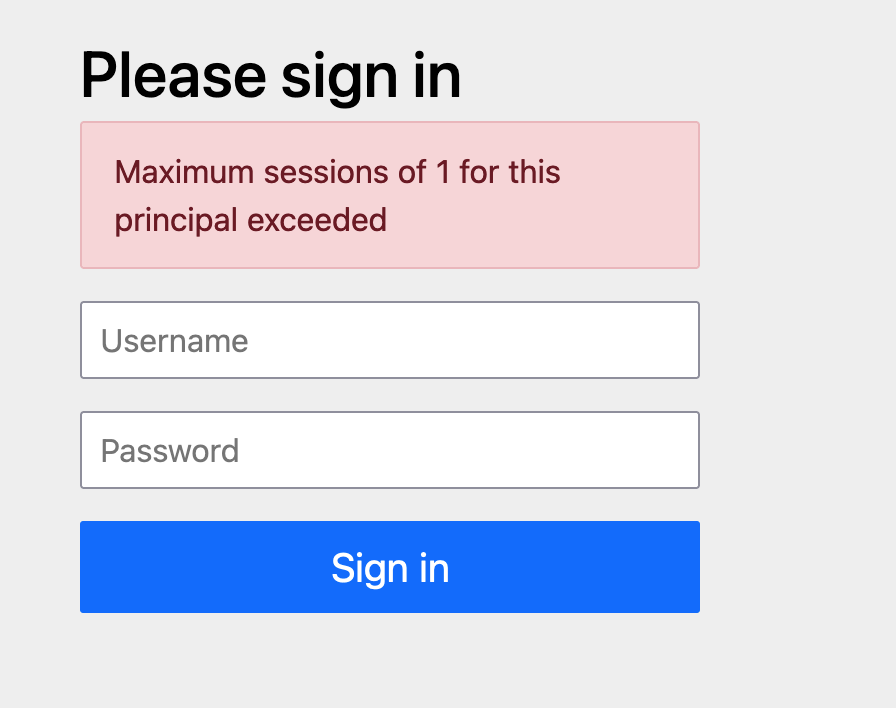

## 添加配置Bean

```java
@Bean
public HttpSessionEventPublisher httpSessionEventPublisher() {
    return new HttpSessionEventPublisher();
}
```

## 场景1

限制同时只能一个账号登录，第二次登录时，顶掉第一次登录。

## Spring Security 增加配置

```java
@Bean
public SecurityFilterChain filterChain(HttpSecurity http) {
    http
        .sessionManagement(session -> session
            .maximumSessions(1)
        );
    return http.build();
}
```

## 场景2

限制同时只能一个账号登录，第二次登录时，进行提示，无法登录。

```java
@Bean
public SecurityFilterChain filterChain(HttpSecurity http) {
    http
        .sessionManagement(session -> session
            .maximumSessions(1)
            .maxSessionsPreventsLogin(true)
        );
    return http.build();
}
```


